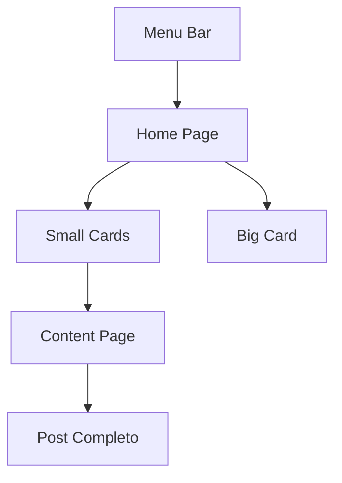

# 📰 Angular Blog

Este projeto é um blog fictício desenvolvido em Angular, com o objetivo de praticar componentização, roteamento, uso de dados mockados e responsividade.


---

## 🚀 Como executar o projeto

1. Instale as dependências:
   ```bash
   npm install
   ```

2. Inicie o servidor local:
   ```bash
   ng serve
   ```

3. Acesse no navegador:
   ```
   http://localhost:4200
   ```

---

## 📦 Estrutura do Projeto

```
src/app/
├── components/
│   ├── big-card/           # Card principal
│   ├── small-card/         # Cards pequenos
│   ├── menu-bar/           # Menu superior
│   └── menu-title/         # Título estilizado do menu
│
├── pages/
│   ├── home/               # Página inicial
│   └── content/            # Página de post completo
│
├── data/
│   └── dataFake.ts         # Conteúdo simulado (mock)
│
├── app-routing.module.ts   # Roteamento das páginas
├── app.module.ts           # Módulo principal
└── app.component.*         # Componente raiz
```

---

## 🧠 Componentização


- **`big-card`**: destaca o conteúdo principal
- **`small-card`**: lista outros posts de forma reduzida
- **`menu-bar`**: navegação
- **`menu-title`**: título customizado do menu
- **`home`**: exibe todos os cards
- **`content`**: exibe um post completo

---

## 🔁 Diagrama Mermaid - Estrutura de Navegação



---

## 👨‍💻 Autor

Desenvolvido por [Seu Nome].  
Este projeto é para fins de estudo e prática com Angular.
